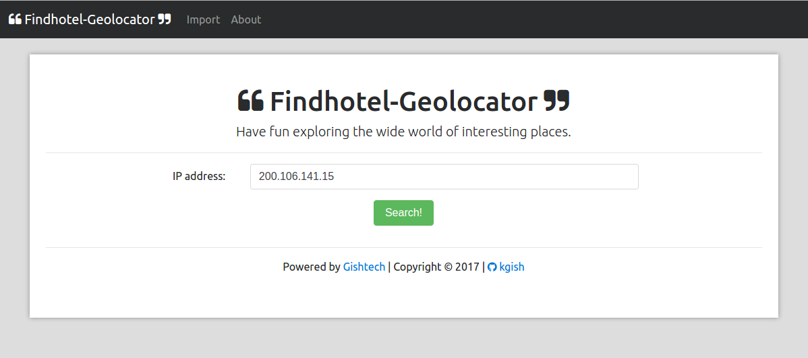

# A Simple Geolocator Gem

This is the demo application which can be used as a simple GUI test engine to verify that the [geolocation gem](https://github.com/kgish/geolocation-gem) is working properly.




## Installation

The installation is straight-forward. We will clone the application demo `geolocation-gem-demo` for the github

```shell
$ git clone https://github.com/kgish/geolocation-gem-demo.git
$ cd geolocation-gem-demo
$ bundle install
$ cd frontend
$ npm install
$ bower install
$ cd ..
$ bin/rails server
```

Go to the import page at `http://localhost:3000/import` and hit the [Import!]-button. Please note, that for demo purposes this import file is a smaller version of the original, having 1000 lines instead of 1000000 lines which take a long time to import: 82 minutes (see below).

See [Rails application](https://github.com/kgish/geolocation-gem#rails-application) for more details and screenshots showing how this application works.


## Geolocation gem

For more information about the geolocation gem, please refer to the [README](https://github.com/kgish/geolocation-gem/blob/master/README.md).


## Heroku deployment

First make sure that you've added the following lines (see above) to your `Gemfile`:

```
gem 'ember-cli-rails'
```

To configure your EmberCLI-Rails applications for Heroku:

```shell
$ bundle exec rails generate ember:heroku
$ git add .
$ git commit -m"Ran rails generate ember:heroku"
```

Make sure that you have heroku installed and then you can create the application, for example:

```shell
$ heroku create geolocation-gem-demo
```

Add the NodeJS buildpack and configure NPM to include the bower dependency's executable file.

```shell
$ heroku buildpacks:clear
$ heroku buildpacks:add --index 1 heroku/nodejs
$ heroku buildpacks:add --index 2 heroku/ruby
$ heroku config:unset SKIP_EMBER
```

You are ready to deploy:

```shell
$ git push heroku master
```

and fire it up (fingers-crossed):

```shell
$ heroku open
```

The url is:

```
https://geolocation-gem-demo.herokuapp.com/
```


## License
The gem is available as open source under the terms of the [MIT License](http://opensource.org/licenses/MIT).


## Author

Kiffin Gish \< kiffin.gish@planet.nl \>

\- You're never too old to learn new stuff.
